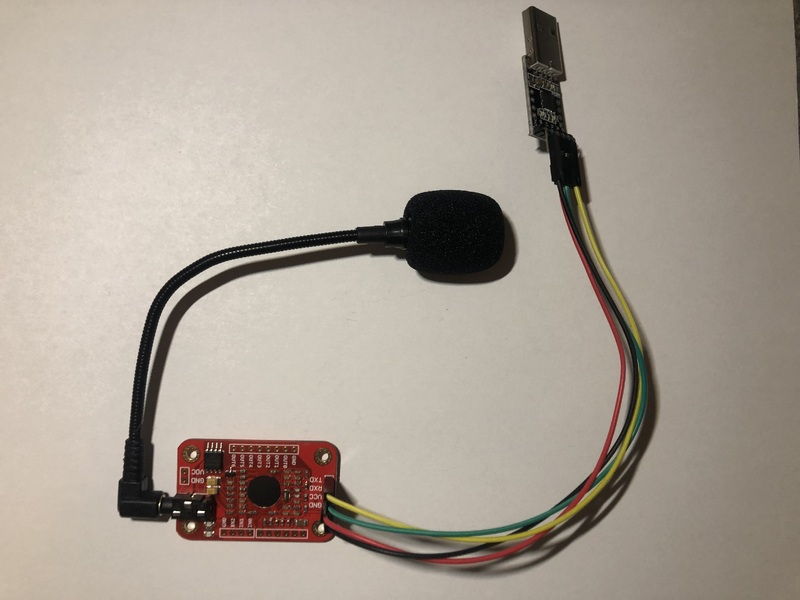
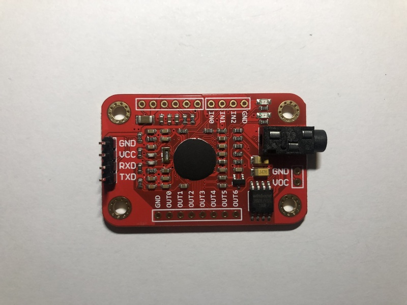
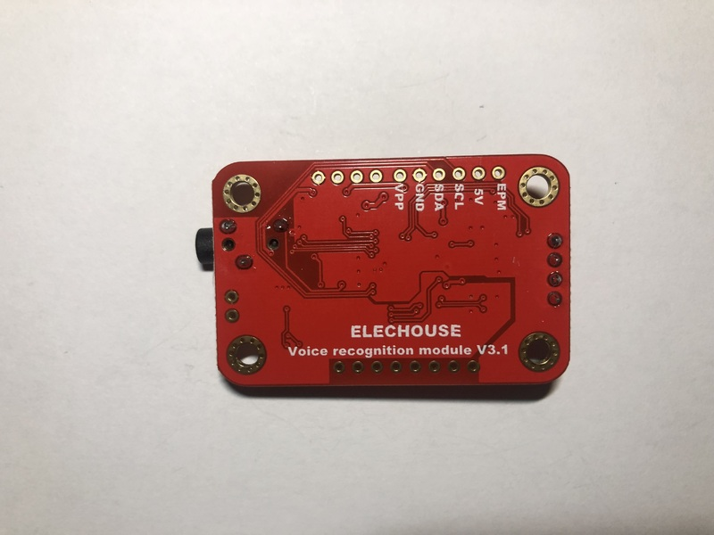

# PyVoiceRecognitionV3

## Installation
```
git clone https://github.com/rzbrk/PyVoiceRecognitionV3.git
cd PyVoiceRecognitionV3/
python -m pip install --user -e .
```

## Description
`PyVoiceRecognitionV3` is a Python class (driver) for the [Elechouse Voice
Recognition Module V3](https://www.elechouse.com/product/speak-recognition-voice-recognition-module-v3/). The class features configuring, training and monitoring the recognition of the module.

## The Elechouse Voice Recognition Module V3



The Elechouse Voice Recognition module is a speaker-dependent voice recognition module. The V3 series of module can be trained up to 80 verbal commands (records) of 1500 ms each. 7 of these records can be simultaniously loaded to a recognizer. The module compares audio recorded by a connected microphone and tries to match it to one of the records in the recognizer. If there is a match it will provide a result. The communication of the module with the outside world is facilitated via 5V GPIO and/or UART ports. More information about the module can be found on the [manufacturer website](https://www.elechouse.com/product/speak-recognition-voice-recognition-module-v3/).





## Class methods

class `PyVoiceRecognitionV3.PyVoiceRecognitionV3`

### \_\_init\_\_()
```
__init__(port='/dev/ttyUSB0', baudrate=9600, tout=10, latency=50)
```

#### Parameters
* port - device name
* baudrate (int) - baud rate such as 9600 or 2400
* tout (int) - timeout for the serial communication in milliseconds (ms)
* latency (int) - latency for the response from the module in miliseconds
  (ms)

#### Returns
Nothing

#### Raises
Nothing

#### Description
Creates and instance of class `PyVoiceRecognitionV3` and immediately opens a
serial port connection to the Voice Recognition Module connected to the serial
port `port`.

### \_\_compile_cmd(payload)
```
__compile_cmd(payload)
```

#### Parameters
* payload (`bytearray`) - payload for the command to be sent to the module

#### Returns
* command (`bytearray`) - command following the command protocol of the module

#### Raises
Nothing

#### Description
The module accepts commands frames following a [specific format ("protocol")](https://github.com/elechouse/VoiceRecognitionV3#protocol). Each command frame consists of a frame header `\xaa`, the payload length,a payload and a frame end `\x0a`:
```
|\xaa|[len]|[payload]|\x0a|
```
`[len]` is computed by the length in bytes of `[len]` itself (always 1) and the
length of `[payload]` in bytes.

The method `__compile_cmd()` will compile a conformal command from the payload by adding the frame header, the payload length and the frame end.

### \_\_send_cmd()
```
__send_cmd(command)
```

#### Parameters
* command (`bytearray`) - command to be sent to the module

#### Returns
Nothing

#### Raises
Nothing

#### Description
Note: Immediately before sending any command to the module the input buffer of the serial port will be flushed.

### \_\_recv_resp()
```
__recv_resp(tout=None, latency=None)
```

#### Parameters
* tout (`int`) or `None` - timeout for the serial communication in milliseconds (ms). If `None`, `self.tout` will be used.
* latency (`int`) or `None` - latency for the response from the module in miliseconds (ms). If `None`, `self.latency` will be used.

#### Returns
* messages (array of `bytearray`) - the response messages (one or multiple) from
  the module

#### Raises
Nothing

#### Description
The response messages from the module basically follow the same format as the
command frames:
```
|\xaa|[len]|[data]|\x0a|
```
`[len]` is computed by the length in bytes of `[len]` itself (always 1) and the
length of `[data]` in bytes.

Long responses are split in multiple messages. Therefore, the return value of
`__recv_resp()` can contain an array of `bytearray`.

### \_\_bytearr2str()
```
__bytearr2str(bytearr)
```

#### Parameters
* bytearr (`bytearray`) - `bytearray` variable to convert to a string

#### Returns
* retstr (`String`) - `String` variable converted from `bytearr`

#### Raises
Nothing

### \_\_default_callback()
```
__default_callback(response_dict)
```

#### Parameters
* response (dict) - dictionary containing the response from the voice
  recognition module

#### Returns
Nothing

#### Raises
Nothing

#### Description
This is a default calöback function for the method `record_recognized()` which
will be invoked every time the module recognized a record.

### send_cmd()
```
send_cmd(command)
```

#### Parameters
* command (`bytearray`) - command to be sent to the module

#### Returns
* messages (array of `bytearray`) - the response messages (one or multiple) from
  the module

#### Raises
Nothing

#### Description
The method `send_cmd()` is meant to be used in an instance of the class to send
a "raw command" to the module. Diffent from the "internal" method
`__send_cmd()` it calls `__recv_cmd()` after sending the command to the module
to read the response of the module to the command.

### check_system_settings()
```
check_system_settings()
```

#### Parameters
None

#### Returns
* response (dict) - dictionary containing the response from the voice
  recognition module

#### Raises
Nothing

### check_recognizer()
```
check_recognizer()
```

#### Parameters
None

#### Returns
* response (dict) - dictionary containing the response from the voice
  recognition module

#### Raises
Nothing

### check_record_train_status()
```
check_record_train_status(record=None)
```

#### Parameters
* record (int) or None - record number to be checked. If None, all records will
  be checked

#### Returns
* response (dict) - dictionary containing the response from the voice
  recognition module

#### Raises
Nothing

### train_record()
```
train_record(record=None)
```

#### Parameters
* record (int) - record number to be trained

#### Returns
* response (dict) - dictionary containing the response from the voice
  recognition module

#### Raises
Nothing

### load_to_recognizer()
```
load_to_recognizer(*records)
```

#### Parameters
* record (int) - record number to be trained

#### Returns
* response (dict) - dictionary containing the response from the voice
  recognition module

#### Raises
Nothing

### clear_recognizer()
```
clear_recognizer()
```

#### Parameters
None

#### Returns
* response (dict) - dictionary containing the response from the voice
  recognition module

#### Raises
Nothing

### record_recognized()
```
record_recognized(timeout=None)
```

#### Parameters
* timeout (int) - timeout in milliseconds to wait for a recognition
* callback_func (name of callback function or None)

#### Returns
Nothing

#### Raises
Nothing

#### Description
This method listens to the module for any recognitions for a time period
defined by `timeout`. If `timeout` is set to `None` the method will practically
listen indefinitely. In case a recognition happend by the module the callback
function defined by `callback_func` is invoked. As an argument a dictionary
will be passed to the callback function containing the response from the
module. The dictionary for the response has the following keys:

* <raw> bytearray - raw message from module
* <time_passed_ms> float - time of recognition in miliseconds after invocation
  of method `record_recognized()`
* <records_in_recognizer> array of int - list of records in recognizer
* <recognized_record> int - the record number of the recognized record
* <index_recognized_record> int - index of the recognized record in the
  recognizer
* <signature_recognized_record> str or None - signature of the recognized
  record if present, otherwise `None`
* <group_mode> int or `None` - group mode of module

A sample custom callback function could look like:
```
def custom_callback_function(response):
    print("Recognized something!")
    for key, value in response.items():
        print("  ", key, value)
    print("")
```

